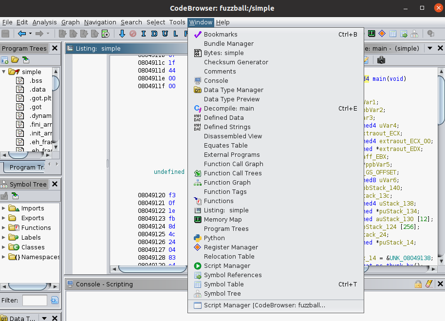
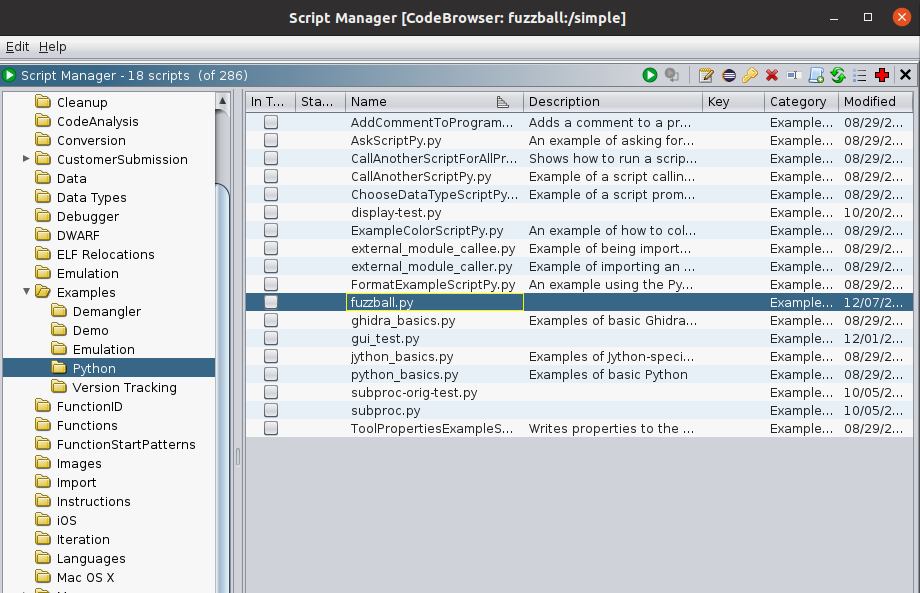

# Installation

## Requirements

- **Operating System:** Ubuntu 20.04 or earlier
- **Hardware:** Recommended 8 GB of RAM
- **Software:** Software: Ghidra (The version these files were tested with is 10.3.3 2023-Aug-29 1442 EDT)

## Steps

1. Download the project files from the [Releases](https://github.com/joonkim0625/fuzzball-ghidrascript/releases/tag/v0.1.0) page.

2. Extract the downloaded archive to your preferred location.

3. Ensure that your system meets the specified requirements:
    - Make sure Ghidra is installed in your system.

4. Navigate to the extracted directory.

5. If the steps above are successfully, you will be able to see these files:

    ```bash
    fuzzball  fuzzball.py  z3
    ```

    You need to place z3 into the /usr/bin directory so that it can be used by
    FuzzBALL when executed. This can be achieved by running sudo cp z3 /usr/bin
    (the use of sudo is necessary as the /usr/bin/ path requires system
    privileges for access).

6. Based on the location of Ghidra installed path, you need to copy the script
   file `fuzzball.py` into the Ghidra Script Manager. For example, if you have
   installed `Ghidra` at the top of your home directory `~/`, the path where
   this script should be located is as follows:

   ```bash
   ~/<Path to Ghidra>/Ghidra/Features/Python/ghidra_script
   ```

   `fuzzball.py` can be placed in any directory of your choice.

7. If you have successfully moved the script into the Ghidra script folder, you
   will be able to see the script from Ghidra Script Manager. 

    You can launch `Ghidra Script Manager` by going to `Windows` and then select
    `Script Manager`.


    

    There is a sidebar on the left, and you can navigate through it to find the script.

    

<br>

For how to use the script, refer to the [Usage](./usage.html) page.

Feel free to reach out if you encounter any issues or have questions.

