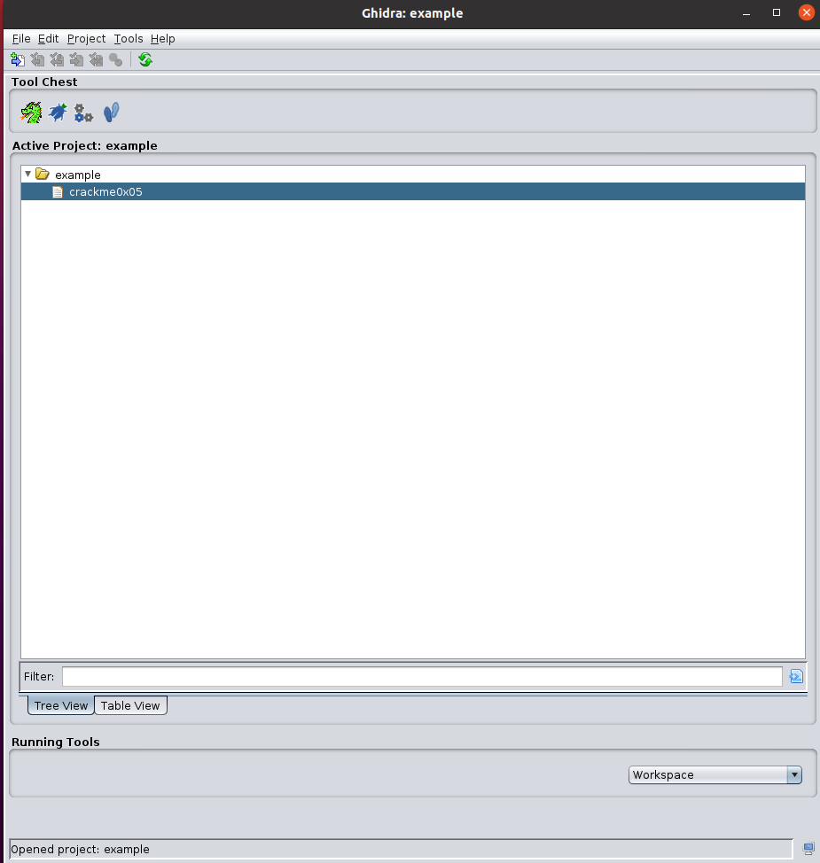
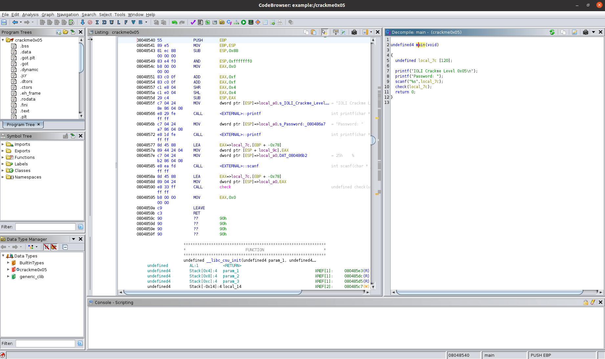
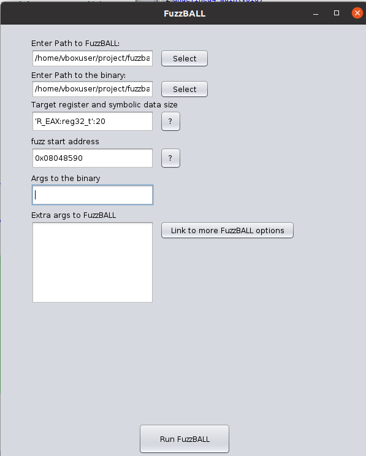
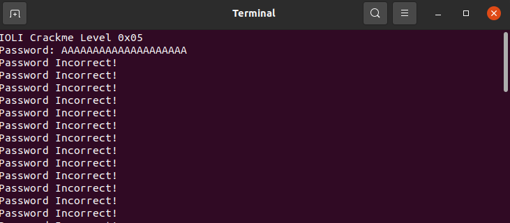
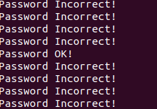

# Example Usage

<br>

I will illustrate the usage of the 'FuzzBALL Ghidra Script' to address a
specific challenge. To follow along, download the 'crackme0x05' binary from [this
link](https://book.rada.re/crackmes/ioli/intro.html). Visit the page and
download the tar file. Extract the contents of the tar file to obtain the
'bin-linux' folder (there will be other folders as well). Within this folder,
locate the 'crackme0x05' binary.

Once you have obtained the binary, let's import it into Ghidra. If you're new to
Ghidra, it will prompt you to create a project folder; simply choose the default
options and assign a name to the folder. Afterward, you can import the binary
you intend to analyze.

From the top menu bar, click on `File` and then select `Import File`. Choose the
binary and click on the binary in the screen, as illustrated below:



Select 'Yes' when prompted to 'Analyze the binary'.

Ghidra will begin decompiling the binary, displaying both the disassembly
version and the decompiled version:



Let's examine the decompiled code and determine where we want to inject the
symbolic value. Unsure about where to inject? If you're new to symbolic
execution, consider searching for information on symbolic execution to grasp the
concept.

The decompiled code looks like this:


```c
undefined4 main(void)

{
  undefined local_7c [120];
  
  printf("IOLI Crackme Level 0x05\n");
  printf("Password: ");
  scanf("%s",local_7c);
  check(local_7c);
  return 0;
}
```

It appears that `scanf` takes user input from the command line and passes it to
the `check` function.

Upon double-clicking the `check` function, Ghidra will display the decompiled code
of the function:

```c
void check(char *param_1)

{
  size_t sVar1;
  char local_11;
  uint local_10;
  int local_c;
  int local_8;
  
  local_c = 0;
  local_10 = 0;
  while( true ) {
    sVar1 = strlen(param_1);
    if (sVar1 <= local_10) break;
    local_11 = param_1[local_10];
    sscanf(&local_11,"%d",&local_8);
    local_c = local_c + local_8;
    if (local_c == 0x10) {
      parell(param_1);
    }
    local_10 = local_10 + 1;
  }
  printf("Password Incorrect!\n");
  return;
}

```

Here, `param_1` is the same as `local_7c` from the main function. Inside the while
loop, `parell(param_1)` is called. Let's examine the `parell` function:

```c
void parell(char *param_1)

{
  uint local_8;
  
  sscanf(param_1,"%d",&local_8);
  if ((local_8 & 1) == 0) {
    printf("Password OK!\n");
                    /* WARNING: Subroutine does not return */
    exit(0);
  }
  return;
}
```

Once again, `param_1` (possibly modified `local_7`) is passed into this function,
and this is the point where we want the execution path to reach. Manually
analyzing all the function calls may take time, so our approach will be to pass
the symbolic value to the **<u>initial</u>** `local_7` so that FuzzBALL can deduce and guide
the execution path.

TODO: explain where to look at from the disassembly code


To initiate symbolic injection, target the following code snippet within the
`main` function:


```c
undefined4 main(void)

{
  undefined local_7c [120];
  
  printf("IOLI Crackme Level 0x05\n");
  printf("Password: ");
  scanf("%s",local_7c);
  check(local_7c);  // <--- ** inject the symbolic value here **
  return 0;
}
```


Examine the disassembly by clicking on the check function in Ghidra. The
corresponding assembly code should be highlighted:

```assembly

08048577 8d 45 88        LEA        EAX=>local_7c,[EBP + -0x78]
0804857a 89 44 24 04     MOV        dword ptr [ESP + local_9c],EAX
0804857e c7 04 24        MOV        dword ptr [ESP]=>local_a0,DAT_080486b2           = 25h    %
            b2 86 04 08
08048585 e8 ea fd        CALL       <EXTERNAL>::scanf                                int scanf(char * __format, ...)
            ff ff
0804858a 8d 45 88        LEA        EAX=>local_7c,[EBP + -0x78]
0804858d 89 04 24        MOV        dword ptr [ESP]=>local_a0,EAX
08048590 e8 33 ff        CALL       check                                            undefined check(undefined4 param
            ff ff
08048595 b8 00 00        MOV        EAX,0x0
            00 00
0804859a c9              LEAVE
0804859b c3              RET
```

You can see the instruction CALL `<EXTERNAL>::scanf`. The subsequent instructions set
up the EAX register before calling the `check` function. Knowing the x86
function call conventions can help a lot here, especially since this is a 32-bit
compiled binary. 

For the FuzzBALL Ghidra Script, you need to express the register where you
intend to inject the symbolic value in Vine IL. For example, for EAX, use
`'R_EAX:reg32_t'` (or `'R_RAX:reg64_t'` for RAX). Ensure the expression is
enclosed in single quotes. (you can learn more about Vine
[here](https://bitblaze.cs.berkeley.edu/vine.html#Publications)) 

Along with the register information, you need to pass the size of symbolic value
which will be an input to the binary. We are not sure how long the input
needs to be, so I suggest you give a decent size value to start with (you don't
want something too short - it is okay to be larger that the actual input size
the binary requires however it should not be shorter than that).

You also need to provide the script with the size of the symbolic value as an
input to the binary. Start with a reasonable size, considering that it shouldn't
be too short. If uncertain, you can lean on the side of a larger size. The size
should be passed in as `'R_EAX:reg32_t':20`. 

Additionally, you need to specify the start of the symbolic execution run,
choosing a point where the chosen register is about to be used for the actual
work. In this example, consider the instruction at `0x08048590`.



Since the binary prompts for user input, no arguments need to be passed
initially. You'll interactively input values once a terminal pops up.

After providing input, the script should do its work:



After some time, it should reach the path where `Password OK!` is printed.
Usually, for a CTF challenge, this would be a some kind of flag that you need to
obtain.



Nice!

I hope this example serves as a helpful starting point!


